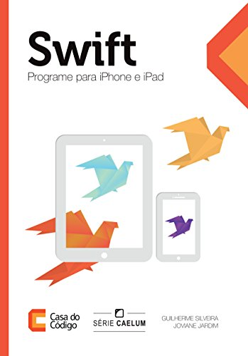
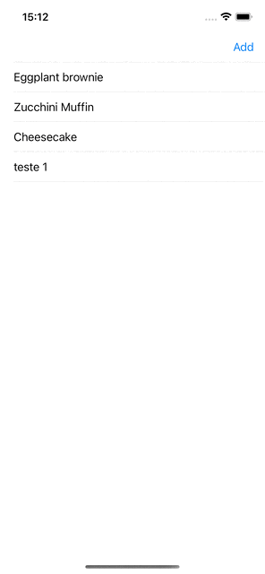

# :orange_book: Swift - Programe para iPhone e iPad
||
| ------- |
##### Livro da `Casa do Código` - `SÉRIE CAELUM` | <i> Autores: Guilherme Silveira e Joviane Jardim </i> | Ano: 2016
#### :package: Link Compra: [Amazon](https://www.amazon.com.br/Swift-Programe-para-iPhone-iPad-ebook/dp/B019OUUZGK)
 
  ### Reeleitura do Livro e do Projeto proposto, agora atualizado para `Swift 5.6` :iphone: e `SDK 16.1` ultilizando:
  - [x] Swift 5.6
  - [x] StoryBoard
  - [x] Xib
  - [x] Viewcode
  - [x] Persistência local usando `UserDefaults`
  
 ## Print Screen :foggy:
 
||
| ------- |
| Projeto Proposto no livro |

##### :point_up: Crétidos do proejto a [`Casa do Código`](https://www.casadocodigo.com.br) `CAELUM`
